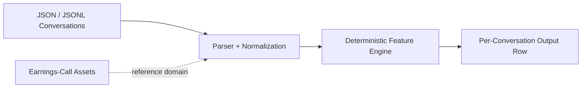

# Deterministic, Explainable Conversation Signal Engine

This repository is now positioned as a deterministic signal extraction engine for messy conversations.

Primary use case:
- customer support QA
- service-risk detection
- escalation and deflection review

Secondary use case:
- earnings-call Q&A analysis as a reference domain and proof layer

The repo name stays as-is for now. The product direction has shifted, but the earnings-call assets remain in place as evidence that the same deterministic workflow can handle long, noisy conversations.

## Quick Start
Single conversation:

```bash
python scripts/analyze_conversation.py data/sample_conversations.json
```

Batch dataset build:

```bash
python scripts/build_dataset.py data/sample_conversations.json
```

Canonical earnings-call proof check:

```bash
python scripts/verify_outputs.py --out-dir outputs/PVH_2025_Q1_call09 --require-run-meta
```

## Sample Output

```json
{
  "conversation_id": "support_good_001",
  "qa_score": 0.7096,
  "directness_score": 0.6405,
  "consistency_score": 0.5413,
  "negative_language_ratio": 0.0,
  "positive_language_ratio": 0.0,
  "hedging_ratio": 0.0,
  "verbosity_ratio": 0.6374,
  "qa_deflection_rate": 0.0,
  "risk_flags": []
}
```

## What It Does
- validates a simple `conversation_id` plus `messages[]` schema
- normalizes messy JSON or JSONL conversation inputs
- pairs customer prompts with the next agent reply deterministically
- extracts explainable lexical and Q&A behavior features
- emits one output row per conversation
- raises deterministic risk flags for frustration, deflection, low directness, and inconsistent messaging

## Deterministic Feature Set
- `positive_language_ratio`
- `negative_language_ratio`
- `hedging_ratio`
- `directness_score`
- `qa_deflection_rate`
- `verbosity_ratio`
- `consistency_score` using TF-IDF only
- `qa_score` from a weighted deterministic formula

## Reference Domain: Earnings Calls
The historical earnings-call workflow remains in the repository as a reference domain, not the primary product. That path still matters because analyst-management Q&A is a strong stress test for:

- noisy multi-turn conversations
- indirect answers
- consistency across replies
- domain-specific risk language

## Portfolio CI
```bash
make portfolio-ci
```

This keeps the canonical PVH_2025_Q1_call09 earnings-call proof path fresh while the repo pivots toward support QA.

## Proof (current state)
<!-- proof:begin -->
- PVH runtime per case: 0.293191 seconds.
- PVH cost per case: not yet measured.
- PVH extracted signals: 199 guidance rows, 4 uncertainty rows, 2 reassurance rows, 1 analyst-skepticism row(s).
- Example outputs: reviewer report at `outputs/PVH_2025_Q1_call09/report.md`.
- Example outputs: structured scorecard at `outputs/PVH_2025_Q1_call09/metrics.json`.
- Example outputs: extracted guidance table at `outputs/PVH_2025_Q1_call09/guidance.csv`.
<!-- proof:end -->

## How It Works
1. Load JSON or JSONL conversations into a generic agent/customer schema.
2. Normalize text and pair customer prompts with the next agent response.
3. Compute deterministic lexical and Q&A behavior features.
4. Write one structured row per conversation for downstream QA or risk review.
5. Keep the legacy earnings-call workflow available as a reference proof path.

## Architecture


No LLMs sit in the core scoring path. No external APIs are required. No UI is required.

## Docs
- [`docs/conversation-schema.md`](docs/conversation-schema.md)
- [`docs/support-qa-mvp.md`](docs/support-qa-mvp.md)
- [`docs/positioning.md`](docs/positioning.md)
- [`docs/demo-path.md`](docs/demo-path.md)
- [`docs/case-study.md`](docs/case-study.md)
- [`docs/capstone-evaluation-summary.md`](docs/capstone-evaluation-summary.md)

## Links To Deeper Docs
- [`docs/demo-path.md`](docs/demo-path.md)
- [`docs/case-study.md`](docs/case-study.md)
- [`docs/retrieval-boundary.md`](docs/retrieval-boundary.md)
- [`docs/architecture-diagram.md`](docs/architecture-diagram.md)
- [`docs/capstone-evaluation-summary.md`](docs/capstone-evaluation-summary.md)
- [`docs/current-status.md`](docs/current-status.md)
- [`app/README.md`](app/README.md)
