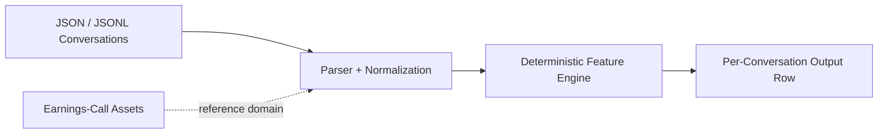

# Signal Engine 2.0

Signal Engine 2.0 is the forward product branch for deterministic, explainable conversation intelligence across support, sales, account management, and earnings-call workflows.

## Positioning

Built now:

- deterministic transcript-first conversation analysis
- support / sales / account-management domain scoring
- legacy support-QA MVP preserved
- earnings calls preserved as a reference vertical and proof layer

Roadmap:

- optional ASR
- optional diarization
- optional audio features
- optional video keyframes
- optional semantic retrieval and long-context review

Core constraints:

- deterministic core first
- transcript path works offline
- no LLM dependency in canonical scoring
- no external APIs required
- no UI required
- evidence-backed outputs only

## Quick Start

Legacy support-QA MVP:

```bash
python scripts/analyze_conversation.py data/sample_conversations.json
```

Signal Engine 2.0 support analysis:

```bash
python scripts/signal_engine_analyze.py --domain support data/signal_engine_2_0/sample_support.json
```

Signal Engine 2.0 sales analysis:

```bash
python scripts/signal_engine_analyze.py --domain sales data/signal_engine_2_0/sample_sales.json
```

Signal Engine 2.0 account-management analysis:

```bash
python scripts/signal_engine_analyze.py --domain account_management data/signal_engine_2_0/sample_account_management.json
```

Signal Engine 2.0 text emotion benchmark:

```bash
python scripts/run_text_emotion_benchmark.py --input data/signal_engine_2_0/emotion_benchmark/sample_emotion_cases.jsonl --manifest data/signal_engine_2_0/dataset_manifests/emotion_benchmark_manifest.json --mode deterministic --redact-pii --out-dir outputs/signal_engine_2_0/text_emotion_benchmark
```

Canonical earnings-call proof check:

```bash
python scripts/verify_outputs.py --out-dir outputs/PVH_2025_Q1_call09 --require-run-meta
```

## Built Now

- `src/parser.py`, `src/features.py`, and `src/pipeline.py` keep the original support-QA MVP intact
- `src/signal_engine/` adds unified schemas and deterministic domain scoring for support, sales, account management, and earnings calls
- sample transcript JSON inputs live in `data/signal_engine_2_0/`
- `scripts/signal_engine_analyze.py` emits unified JSON to stdout

## Emotion and Multimodal Roadmap

Built now:

- deterministic transcript signals
- buyer demo pack
- optional registries
- benchmark harness skeleton
- adapter placeholders
- deterministic text emotion benchmark baseline
- privacy redaction fallback
- dataset ingestion and manifest validation

Not built yet:

- production ASR
- diarization
- text emotion inference
- speech emotion inference
- video emotion inference
- multimodal fusion

Constraints:

- no truth-detection claims
- no black-box emotion score as canonical output
- deterministic output remains source of truth
- production text emotion models require optional deps
- ASR/diarization/audio/video remain adapter-ready roadmap
- PII redaction fallback exists now
- Presidio remains optional enhancement

## Unified Output

```json
{
  "schema_version": "signal_engine_2.0",
  "domain": "support",
  "conversation_id": "support_refund_escalation_001",
  "scores": {
    "directness_score": 0.12,
    "deflection_score": 0.75
  },
  "risk_flags": [
    "support_deflection"
  ],
  "opportunity_flags": [],
  "evidence": [
    {
      "signal_name": "deflection",
      "message_index": 1,
      "matched_text": "Another team handles refunds...",
      "reason": "Support deflection language detected."
    }
  ],
  "metadata": {
    "deterministic": true,
    "external_api_required": false
  }
}
```

## Portfolio CI

```bash
make portfolio-ci
```

This keeps the canonical PVH_2025_Q1_call09 earnings-call proof path fresh while Signal Engine 2.0 grows around it.

## Proof (current state)
<!-- proof:begin -->
- PVH runtime per case: 0.293191 seconds.
- PVH cost per case: not yet measured.
- PVH extracted signals: 199 guidance rows, 4 uncertainty rows, 2 reassurance rows, 1 analyst-skepticism row(s).
- Example outputs: reviewer report at `outputs/PVH_2025_Q1_call09/report.md`.
- Example outputs: structured scorecard at `outputs/PVH_2025_Q1_call09/metrics.json`.
- Example outputs: extracted guidance table at `outputs/PVH_2025_Q1_call09/guidance.csv`.
<!-- proof:end -->

## How It Works

1. Load transcript JSON or JSONL into a normalized conversation schema.
2. Preserve ordered roles, turns, timestamps, and provenance.
3. Apply deterministic lexicons, regexes, and turn-structure rules.
4. Emit domain scores, flags, and evidence in one unified output schema.
5. Keep the legacy support-QA MVP and earnings-call proof path available in parallel.

## Architecture


No LLMs sit in the core scoring path. No external APIs are required. No UI is required.

## Docs

- [`docs/signal-engine-2.0.md`](docs/signal-engine-2.0.md)
- [`docs/emotion-inference-roadmap.md`](docs/emotion-inference-roadmap.md)
- [`docs/model-and-dataset-registry.md`](docs/model-and-dataset-registry.md)
- [`docs/text-emotion-benchmark.md`](docs/text-emotion-benchmark.md)
- [`docs/privacy-redaction.md`](docs/privacy-redaction.md)
- [`docs/dataset-ingestion.md`](docs/dataset-ingestion.md)
- [`docs/domain-schemas.md`](docs/domain-schemas.md)
- [`docs/multimodal-stack.md`](docs/multimodal-stack.md)
- [`docs/library-evaluation-matrix.md`](docs/library-evaluation-matrix.md)
- [`docs/support-qa-mvp.md`](docs/support-qa-mvp.md)
- [`docs/conversation-schema.md`](docs/conversation-schema.md)
- [`docs/architecture-diagram.md`](docs/architecture-diagram.md)
- [`docs/current-status.md`](docs/current-status.md)
