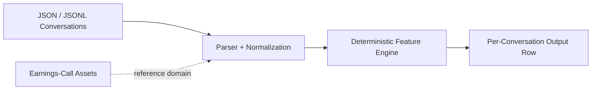

# Signal Engine 2.0

Signal Engine 2.0 is a transcript-first, deterministic signal extraction engine for messy business conversations. Earnings calls are the primary portfolio and capstone use case, while support, sales, and account-management examples show that the same evidence-backed architecture generalizes to other review workflows.

The system extracts specific, reviewable signals with evidence snippets rather than broad black-box sentiment claims. It is not trading automation, truth detection, or unsupported sentiment magic.

## Positioning

Built now:

- deterministic transcript-first conversation analysis
- support / sales / account-management domain scoring
- legacy support-QA MVP preserved
- earnings calls preserved as the primary portfolio proof layer

Roadmap:

- optional ASR
- optional diarization
- optional audio features
- optional video keyframes
- optional semantic retrieval and long-context review

Core constraints:

- deterministic core first
- transcript path works offline
- deterministic outputs are canonical
- no LLM dependency in canonical scoring
- no external APIs required
- no UI required
- evidence-backed outputs only
- no truth-detection claims
- no alpha claims or unsupported statistical significance claims

## Why This Matters

- messy conversations and transcripts are hard to review consistently at scale
- generic AI summaries are broad, hard to audit, and easy to over-trust
- this system produces structured, evidence-backed signals with reproducible outputs that a reviewer can inspect and challenge

## Review Package

- simple architecture: [`docs/architecture-simple.md`](docs/architecture-simple.md)
- evaluation proof: [`docs/evaluation-proof.md`](docs/evaluation-proof.md)
- hero output: [`docs/hero-output.md`](docs/hero-output.md)
- recruiter/buyer examples: [`demo/signal_engine_2_0/polished_examples.md`](demo/signal_engine_2_0/polished_examples.md)
- NLP research manifest: [`docs/nlp-research-manifest.md`](docs/nlp-research-manifest.md)
- final review summary: [`docs/signal-engine-2.0-final-review.md`](docs/signal-engine-2.0-final-review.md)
- best-in-class roadmap: [`docs/best-in-class-nlp-roadmap.md`](docs/best-in-class-nlp-roadmap.md)

## First Proof Package

- final portfolio case study: [`docs/final-portfolio-case-study.md`](docs/final-portfolio-case-study.md)
- transcript baseline benchmark: [`docs/transcript-baseline-benchmark.md`](docs/transcript-baseline-benchmark.md)
- human-reviewed labeling guide: [`docs/human-reviewed-labeling-guide.md`](docs/human-reviewed-labeling-guide.md)
- human-reviewed signal labels: [`data/nlp_research/human_reviewed_signal_labels.jsonl`](data/nlp_research/human_reviewed_signal_labels.jsonl)
- multimodal pilot status: [`docs/multimodal-pilot-status.md`](docs/multimodal-pilot-status.md)
- label review workflow: [`docs/label-review-workflow.md`](docs/label-review-workflow.md)
- label agreement status: [`docs/label-agreement-status.md`](docs/label-agreement-status.md)
- audio pilot intake guide: [`docs/audio-pilot-intake-guide.md`](docs/audio-pilot-intake-guide.md)
- audio pilot asset status: [`docs/audio-pilot-asset-status.md`](docs/audio-pilot-asset-status.md)
- public resource fit report: [`docs/public-resource-fit-report.md`](docs/public-resource-fit-report.md)
- signal error analysis: [`docs/signal-error-analysis.md`](docs/signal-error-analysis.md)
- gold holdout candidates: [`docs/gold-holdout-set-guide.md`](docs/gold-holdout-set-guide.md)
- retrieval scaffold: [`docs/signal-retrieval-scaffold.md`](docs/signal-retrieval-scaffold.md)
- second-review priority queue: [`docs/second-review-priority.md`](docs/second-review-priority.md)

Refresh command:

```bash
make first-proof-refresh
```

Best-in-class backbone refresh:

```bash
make best-in-class-refresh
```

Data growth refresh:

```bash
make data-growth-refresh
```

Current automation status:

- reviewer packet generation is automated
- second-review agreement stays in a blocked state until reviewer labels are filled
- audio pilot intake and validation stay blocked until approved aligned clips are added
- best-in-class backbone status: resource fit ranking, error analysis, gold holdout candidates, retrieval scaffold, and second-review prioritization are now refreshable

## Data Growth Path

- local support, sales, account-management, and earnings-call fixtures remain the primary training source
- Loughran-McDonald is the canonical finance lexicon support path when a local, license-reviewed dictionary export is available
- Financial PhraseBank stays benchmark-only and is never mixed into canonical training data automatically
- candidate mining creates review queues, not automatic truth
- manual review is still required before promotion into `data/nlp_research/human_reviewed_signal_labels.jsonl`

Supporting docs:

- [`docs/loughran-mcdonald-integration.md`](docs/loughran-mcdonald-integration.md)
- [`docs/financial-phrasebank-benchmark.md`](docs/financial-phrasebank-benchmark.md)
- [`docs/signal-label-candidate-mining.md`](docs/signal-label-candidate-mining.md)
- [`docs/label-promotion-workflow.md`](docs/label-promotion-workflow.md)
- [`docs/label-dataset-growth-report.md`](docs/label-dataset-growth-report.md)

## Quick Start

Legacy support-QA MVP:

```bash
python scripts/analyze_conversation.py data/sample_conversations.json
```

Signal Engine 2.0 support analysis:

```bash
python scripts/signal_engine_analyze.py --domain support data/signal_engine_2_0/sample_support.json
```

Signal Engine 2.0 sales analysis:

```bash
python scripts/signal_engine_analyze.py --domain sales data/signal_engine_2_0/sample_sales.json
```

Signal Engine 2.0 account-management analysis:

```bash
python scripts/signal_engine_analyze.py --domain account_management data/signal_engine_2_0/sample_account_management.json
```

Signal Engine 2.0 text emotion benchmark:

```bash
python scripts/run_text_emotion_benchmark.py --input data/signal_engine_2_0/emotion_benchmark/sample_emotion_cases.jsonl --manifest data/signal_engine_2_0/dataset_manifests/emotion_benchmark_manifest.json --mode deterministic --redact-pii --out-dir outputs/signal_engine_2_0/text_emotion_benchmark
```

Canonical earnings-call proof check:

```bash
python scripts/verify_outputs.py --out-dir outputs/LLY_2025_Q2_call08 --require-run-meta
```

## Built Now

- `src/parser.py`, `src/features.py`, and `src/pipeline.py` keep the original support-QA MVP intact
- `src/signal_engine/` adds unified schemas and deterministic domain scoring for support, sales, account management, and earnings calls
- sample transcript JSON inputs live in `data/signal_engine_2_0/`
- `scripts/signal_engine_analyze.py` emits unified JSON to stdout

## Signal Engine 2.0 status

### Works now

- deterministic support, sales, and account-management transcript analysis
- optional deterministic PII redaction in `signal_engine_analyze.py`
- deterministic text emotion benchmark harness with dataset manifest validation
- final demo runner via `python scripts/run_signal_engine_2_0_demo.py`
- transcript-first, evidence-backed outputs that stay inspectable and reproducible

### How to run the full demo

```bash
python scripts/run_signal_engine_2_0_demo.py
```

CLI examples:

```bash
python scripts/signal_engine_analyze.py --domain support data/signal_engine_2_0/sample_support.json
python scripts/signal_engine_analyze.py --domain sales data/signal_engine_2_0/sample_sales.json
python scripts/signal_engine_analyze.py --domain account_management data/signal_engine_2_0/sample_account_management.json
python scripts/signal_engine_analyze.py --domain support --redact-pii data/signal_engine_2_0/fixtures/support_tickets_realistic.jsonl
python scripts/run_text_emotion_benchmark.py --input data/signal_engine_2_0/emotion_benchmark/sample_emotion_cases.jsonl --manifest data/signal_engine_2_0/dataset_manifests/emotion_benchmark_manifest.json --mode deterministic --redact-pii --out-dir outputs/signal_engine_2_0/text_emotion_benchmark
```

### Output examples

- final demo bundle: `outputs/signal_engine_2_0/final_demo/`
- polished recruiter/buyer examples: `demo/signal_engine_2_0/polished_examples.md`
- benchmark outputs: `outputs/signal_engine_2_0/text_emotion_benchmark/`

### Roadmap

- optional transformer text emotion comparisons
- optional ASR and diarization
- optional audio features and escalation-only video review
- optional retrieval and later multimodal fusion
- optional model sidecars remain adapters and benchmarks, not canonical truth

## Multimodal Signal Engine Direction

- transcript remains canonical
- audio and video remain optional review cues
- success is measured by reviewer usefulness, evidence quality, and auditability, not emotion certainty
- optional pretrained adapters are benchmark-only and off by default

Supporting docs:

- [`docs/multimodal-signal-taxonomy.md`](docs/multimodal-signal-taxonomy.md)
- [`docs/dataset-and-research-map.md`](docs/dataset-and-research-map.md)
- [`docs/multimodal-architecture.md`](docs/multimodal-architecture.md)
- [`docs/multimodal-evaluation-protocol.md`](docs/multimodal-evaluation-protocol.md)
- [`docs/multimodal-roadmap.md`](docs/multimodal-roadmap.md)
- [`docs/multimodal-signal-engine-review.md`](docs/multimodal-signal-engine-review.md)

### Known legacy note

- `make portfolio-ci` now passes in clean Signal Engine 2.0 checkouts even when the local legacy `outputs/LLY_2025_Q2_call08/` bundle is incomplete
- when legacy proof artifacts are missing, CI emits a warning and skips the legacy proof refresh, freshness, and doc-audit path instead of crashing
- current Signal Engine 2.0 demo validation remains separate and strict through focused tests and CLI checks

## Emotion and Multimodal Roadmap

Built now:

- deterministic transcript signals
- buyer demo pack
- optional registries
- benchmark harness skeleton
- adapter placeholders
- deterministic text emotion benchmark baseline
- privacy redaction fallback
- dataset ingestion and manifest validation

Not built yet:

- production ASR
- diarization
- text emotion inference
- speech emotion inference
- video emotion inference
- multimodal fusion

Constraints:

- no truth-detection claims
- no black-box emotion score as canonical output
- deterministic output remains source of truth
- production text emotion models require optional deps
- ASR/diarization/audio/video remain adapter-ready roadmap
- PII redaction fallback exists now
- Presidio remains optional enhancement

## Unified Output

```json
{
  "schema_version": "signal_engine_2.0",
  "domain": "support",
  "conversation_id": "support_refund_escalation_001",
  "scores": {
    "directness_score": 0.12,
    "deflection_score": 0.75
  },
  "risk_flags": [
    "support_deflection"
  ],
  "opportunity_flags": [],
  "evidence": [
    {
      "signal_name": "deflection",
      "message_index": 1,
      "matched_text": "Another team handles refunds...",
      "reason": "Support deflection language detected."
    }
  ],
  "metadata": {
    "deterministic": true,
    "external_api_required": false
  }
}
```

## Portfolio CI

```bash
make portfolio-ci
```

This keeps the canonical `LLY_2025_Q2_call08` earnings-call proof path available when the legacy artifact bundle is present, without letting missing legacy files block the current deterministic Signal Engine 2.0 demo path.

## Proof (current state)
<!-- proof:begin -->
- Canonical earnings-call proof bundle: `outputs/LLY_2025_Q2_call08/`.
- Existing machine-readable proof artifact: `outputs/LLY_2025_Q2_call08/portfolio_proof.json`.
- `make portfolio-ci` refreshes and audits this legacy proof only when the committed artifact bundle is present locally.
- If `metrics.json` or other legacy proof files are missing, CI emits a warning and skips the legacy proof refresh path instead of crashing.
- Signal Engine 2.0 demo validation remains transcript-first, deterministic, and separate from this legacy proof bundle.
<!-- proof:end -->

## How It Works

1. Load transcript JSON or JSONL into a normalized conversation schema.
2. Preserve ordered roles, turns, timestamps, and provenance.
3. Apply deterministic lexicons, regexes, and turn-structure rules.
4. Emit domain scores, flags, and evidence in one unified output schema.
5. Keep the legacy support-QA MVP and earnings-call proof path available in parallel.

## Architecture


No LLMs sit in the core scoring path. No external APIs are required. No UI is required.

## Docs

- [`docs/architecture-simple.md`](docs/architecture-simple.md)
- [`docs/evaluation-proof.md`](docs/evaluation-proof.md)
- [`docs/hero-output.md`](docs/hero-output.md)
- [`docs/nlp-research-plan.md`](docs/nlp-research-plan.md)
- [`docs/nlp-research-manifest.md`](docs/nlp-research-manifest.md)
- [`docs/nlp-baseline-report.md`](docs/nlp-baseline-report.md)
- [`docs/signal-engine-2.0-final-review.md`](docs/signal-engine-2.0-final-review.md)
- [`docs/multimodal-signal-taxonomy.md`](docs/multimodal-signal-taxonomy.md)
- [`docs/dataset-and-research-map.md`](docs/dataset-and-research-map.md)
- [`docs/multimodal-architecture.md`](docs/multimodal-architecture.md)
- [`docs/multimodal-evaluation-protocol.md`](docs/multimodal-evaluation-protocol.md)
- [`docs/multimodal-roadmap.md`](docs/multimodal-roadmap.md)
- [`docs/multimodal-signal-engine-review.md`](docs/multimodal-signal-engine-review.md)
- [`docs/signal-engine-2.0.md`](docs/signal-engine-2.0.md)
- [`docs/signal-engine-2.0-review-package.md`](docs/signal-engine-2.0-review-package.md)
- [`docs/signal-engine-2.0-architecture.md`](docs/signal-engine-2.0-architecture.md)
- [`docs/emotion-inference-roadmap.md`](docs/emotion-inference-roadmap.md)
- [`docs/model-and-dataset-registry.md`](docs/model-and-dataset-registry.md)
- [`docs/text-emotion-benchmark.md`](docs/text-emotion-benchmark.md)
- [`docs/privacy-redaction.md`](docs/privacy-redaction.md)
- [`docs/dataset-ingestion.md`](docs/dataset-ingestion.md)
- [`docs/domain-schemas.md`](docs/domain-schemas.md)
- [`docs/multimodal-stack.md`](docs/multimodal-stack.md)
- [`docs/library-evaluation-matrix.md`](docs/library-evaluation-matrix.md)
- [`docs/support-qa-mvp.md`](docs/support-qa-mvp.md)
- [`docs/conversation-schema.md`](docs/conversation-schema.md)
- [`docs/architecture-diagram.md`](docs/architecture-diagram.md)
- [`docs/current-status.md`](docs/current-status.md)
