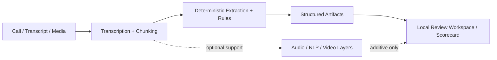

# Architecture Diagram

This repo is intentionally transcript-first. Deterministic artifacts are canonical, and audio/NLP/video layers are supportive only.

## Component Notes
- **Call / Transcript / Media**: input can come from a transcript, YouTube replay, local media file, or document text.
- **Transcription + Chunking**: normalizes the source into reviewable segments.
- **Deterministic Extraction + Rules**: produces auditable guidance, tone, and behavior outputs.
- **Structured Artifacts**: writes the canonical files used for review.
- **Local Review Workspace / Scorecard**: the local shell and checked-in reports for analyst review.
- **Audio / NLP / Video Layers**: optional support layers that add context without replacing the transcript-first path.
