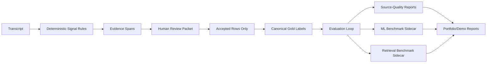

# Simple Architecture

Deterministic output remains canonical. Human review grows the gold set. ML and retrieval are sidecars for benchmarking and search/review readiness; they do not override labels.

## Gates

- ML benchmark: allowed after `>=50` labels.
- Retrieval benchmark: allowed after `>=100` labels or explicit experiment mode.
- External datasets: local verified files only.
- Gold promotion: accepted human-reviewed rows only.
