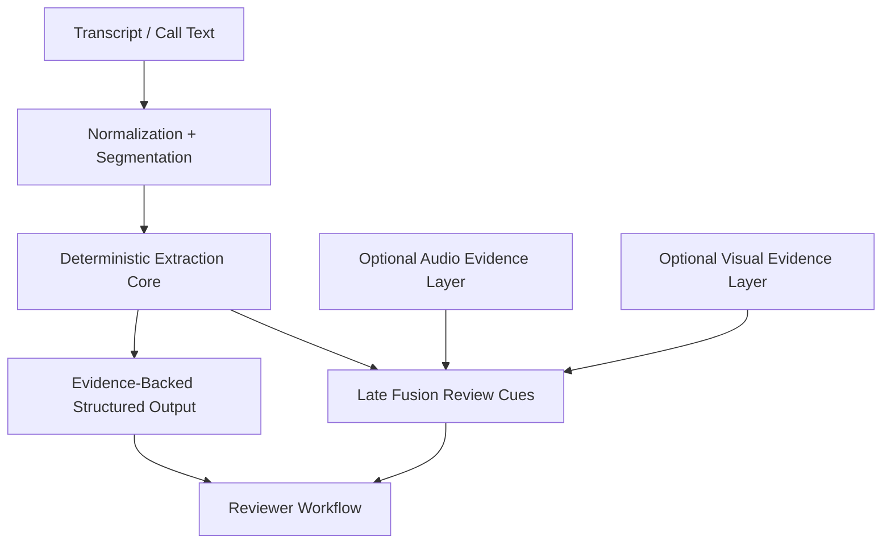

# Multimodal Architecture

## Design

Signal Engine 2.0 keeps transcript review as the primary path and layers optional side cues on top.

## Canonical Now

- transcript normalization
- deterministic extraction
- evidence-backed JSON outputs

## Optional

- bounded audio feature extraction
- bounded video quality and motion proxies
- benchmark-only transformer emotion checks

## Roadmap

- stronger aligned fixtures
- reviewer lift evaluation
- optional pretrained adapters
- later multimodal fusion benchmarks

## Why Not Deep Multimodal-First

- transcript evidence is easier to audit
- optional side cues can create false certainty if introduced too early
- the portfolio package needs lightweight CI, reviewability, and clear safety boundaries
