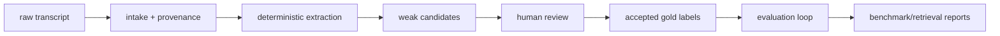

# Portfolio Architecture

Signal Engine 2.0 is a transcript-first evaluation system. It starts with public or local transcripts, preserves provenance, extracts deterministic signal candidates, routes candidates through human review, and measures outputs against accepted labels.

Deterministic transcript outputs remain canonical. ML and retrieval are benchmark/support layers that help evaluate and inspect the workflow; they do not override reviewed labels.

## Main components

- Intake records source URLs, transcript files, parse status, and provenance.
- Source discovery generates and verifies public transcript URL candidates without accepting paywalled or blocked pages.
- Deterministic extraction identifies evidence-backed signal candidates from transcript text.
- Review packets make each candidate inspectable by a human reviewer.
- Accepted rows can be promoted into canonical gold labels.
- Evaluation reports track deterministic metrics, source-quality subsets, ML baseline behavior, and retrieval gates.

## Reusable architecture pattern

This pattern can apply beyond earnings calls:

- sales call quality
- customer support QA
- renewal-risk detection
- internal AI tool governance
- compliance review
- product feedback analysis

Those are transferable product patterns, not claims that every domain is fully implemented here.
