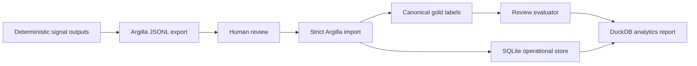

# Review Evaluation Architecture

The review loop connects deterministic extraction to human-reviewed gold labels and measurable evaluation artifacts.

## Components

- `tools/export_argilla_dataset.py`: converts deterministic JSONL rows into local Argilla-ready records.
- `tools/import_argilla_reviews.py`: validates reviewed rows and writes canonical review/gold outputs.
- `src/signal_engine/storage/sqlite_store.py`: initializes the local operational tables.
- `tools/run_review_evaluation.py`: compares deterministic outputs against canonical gold labels.
- `tools/build_duckdb_analytics.py`: summarizes review and evaluation metrics.
- `tools/run_review_pipeline_dryrun.py`: proves the local flow with tiny offline fixtures.

## Truth Boundaries

Deterministic outputs are candidates. Argilla records are review transport. Human-accepted reviewed rows become canonical only after strict import validation. Weak labels are never auto-promoted.

Canonical path:

`deterministic extraction -> review candidate -> reviewed import -> validated gold label`

## SQLite Role

SQLite tracks lifecycle state: corpus cases, review records, gold labels, provenance events, and evaluation runs. It is operational memory, not a replacement for committed JSONL/CSV source artifacts.

## DuckDB Analytics Role

The analytics layer reads local artifacts and summarizes evaluation health. It supports reviewer operations and error analysis, but it does not modify labels.
