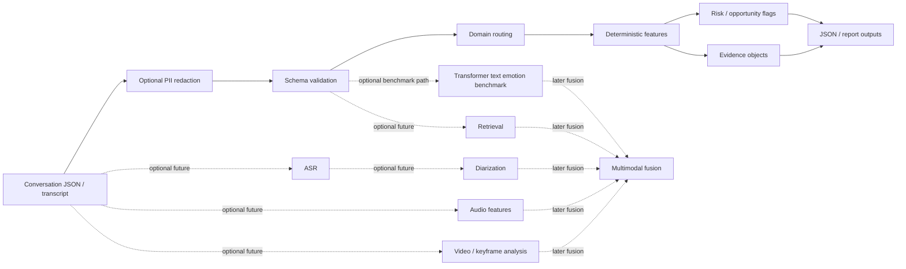

# Signal Engine 2.0 Architecture

## Canonical Flow

Conversation JSON / transcript  
→ optional PII redaction  
→ schema validation  
→ domain routing  
→ deterministic features  
→ risk/opportunity flags  
→ evidence objects  
→ JSON/report outputs

## Mermaid View

## Notes

- deterministic transcript output remains canonical
- optional emotion, model, audio, and video layers are enrichment or roadmap only
- no truth-detection claim is made anywhere in the architecture
- no black-box emotion score becomes canonical product truth
